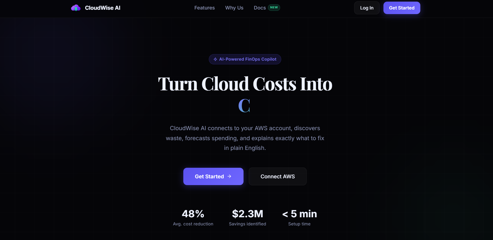
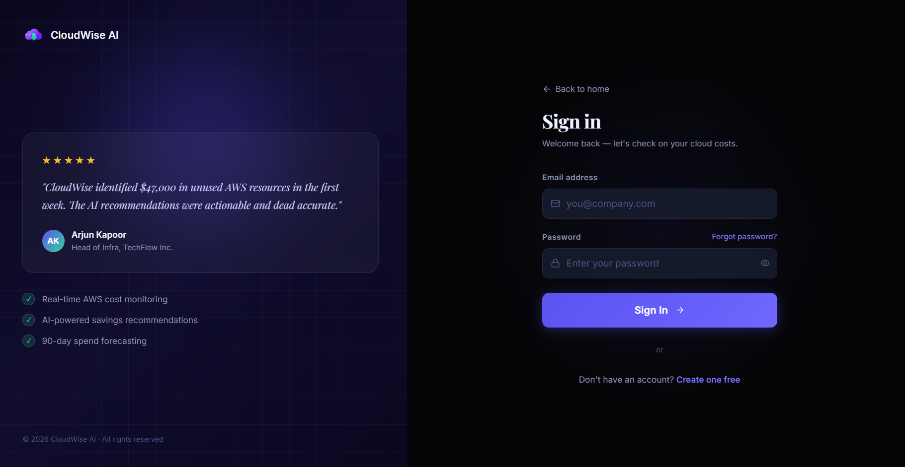
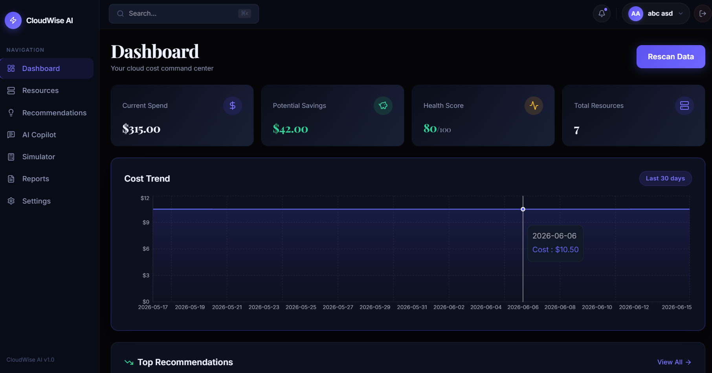
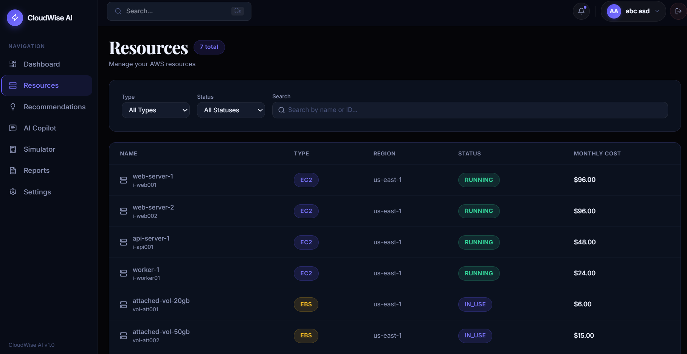
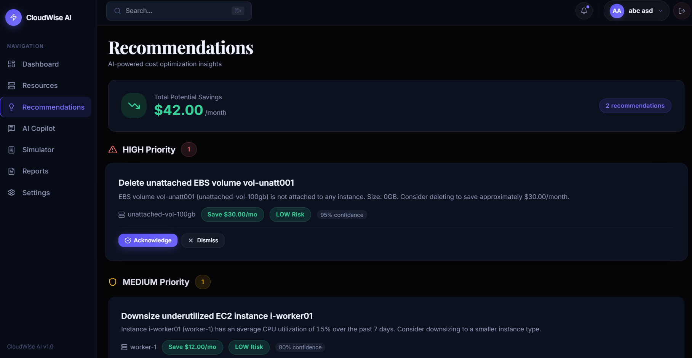
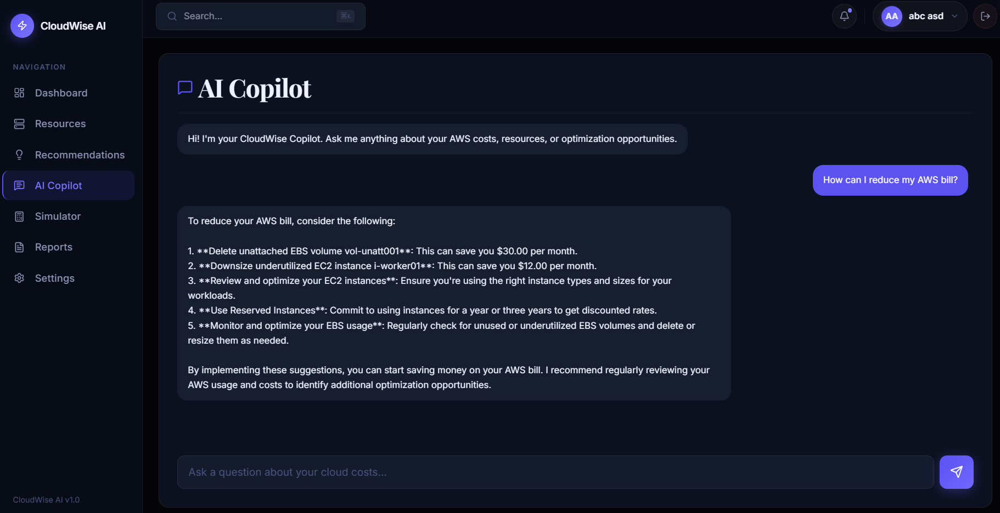
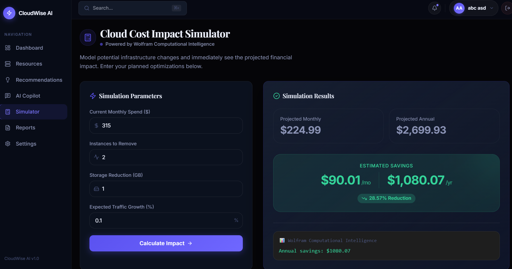

# CloudWise AI

**Team Name:** ideaforge  
**Team Members:** 
- Krisha Prakashkumar Kalal ([@krisha-kalal](https://github.com/krisha-kalal))
- Akhil Biju Varghese ([@DeadlyPro34](https://github.com/DeadlyPro34))

**Live Demo:** [https://cloudwise-frontend.onrender.com](https://cloudwise-frontend.onrender.com)

> [!IMPORTANT]
> **Notes for Judges & Reviewers:**
> - **Free Tier Limitations:** The backend runs on Render's free tier, meaning it **spins down after 15 minutes of inactivity**. The very first request after the server sleeps may take 30-60 seconds to wake up. Please be patient on your first visit!
> - **Database:** The free PostgreSQL instance will expire after 90 days (which is perfectly fine for the scope of this hackathon).

---

## 2. Overview
CloudWise AI is an autonomous FinOps Copilot designed to tackle cloud infrastructure waste. It connects securely to your AWS account to discover active infrastructure, analyze costs, detect anomalies, forecast spending, and generate actionable optimization recommendations. It simplifies cloud billing complexities by explaining them in plain English via a built-in AI Copilot.

**Problem it solves:** Engineering teams often overspend on cloud resources due to lack of visibility, unattached EBS volumes, idle EC2 instances, and difficult-to-understand billing dashboards. CloudWise AI acts as an intelligent watchdog that translates dense cloud billing data into actionable, money-saving insights.

**Who it is for:** Cloud Architects, DevOps Engineers, and Engineering Managers who want strict control over their AWS spending without needing a PhD in AWS billing.

## 3. Features
- **Seamless AWS Integration:** Connect AWS accounts via secure IAM credentials for read-only infrastructure discovery.
- **Resource Discovery:** Automatically scans and inventories EC2 instances and EBS volumes.
- **Cost Analysis Dashboard:** In-depth cost tracking, anomaly detection, and an overall Cloud Health Score.
- **Recommendations Engine:** Identifies idle compute and unattached storage to provide actionable rightsizing advice.
- **Spend Forecasting:** Predicts future AWS costs using machine learning models.
- **Cloud Simulator:** See how much money you would save by dropping a specific resource in real-time.
- **AI Copilot:** An intelligent chatbot powered by Llama 3.3 70B (via Groq) to answer plain-English questions about your cloud environment and billing.
- **Exportable Reports:** Download detailed PDF reports summarizing infrastructure and costs.

## 4. Screenshots / Preview

### Landing Page


### Sign Up / Authentication


### Cost Analysis Dashboard


### Resource Management


### AI Rightsizing Recommendations


### AI Copilot Chat


### Cloud Cost Simulator


## 5. Tech Stack
- **Frontend:** React 19, TypeScript, Vite, React Router, Recharts, Lucide React
- **Backend:** Python 3.12, FastAPI, SQLAlchemy 2, Pydantic v2
- **Database:** PostgreSQL 16
- **Machine Learning & Integrations:** Prophet (forecasting), Boto3 (AWS SDK), Groq API (Llama 3.3 70B)
- **Deployment:** Docker, Render

## 6. Installation

The easiest way to run the entire application stack locally (including the database and LocalStack for AWS mocking) is using **Docker**. Alternatively, you can run the services manually.

### Prerequisites
- Node.js 22+
- Python 3.12+
- Docker & Docker Desktop (Required for LocalStack & local PostgreSQL)
- Groq API Key (Available for free at [console.groq.com](https://console.groq.com/))

### Clone the repository
```bash
git clone https://github.com/DeadlyPro34/Cloudwise_ai.git
cd Cloudwise_ai
```

### Docker & LocalStack Setup (Recommended)
LocalStack allows you to mock AWS services locally without incurring any costs.
```bash
# Start all services (Frontend, Backend, PostgreSQL, and LocalStack)
docker-compose up -d --build

# To check if LocalStack is running properly on port 4566:
curl http://localhost:4566/_localstack/health
```
Once running via Docker, you can access the app at `http://localhost:5173`. 
*(Note: When connecting your AWS account in the UI, make sure to check the "Use LocalStack" box!)*

---

### Manual Setup (Without Docker)
If you prefer to run the frontend and backend manually for development:

### Set up Environment Variables
**Backend Configuration:**
```bash
cd backend
cp .env.example .env
```
Open `backend/.env` and add your `GROQ_API_KEY` and a securely generated `JWT_SECRET` and `ENCRYPTION_KEY`.

**Frontend Configuration:**
```bash
cd ../frontend
cp .env.example .env
```
Ensure your `VITE_API_URL` points to `http://127.0.0.1:8000/api/v1` for local development.

### Run the Backend
```bash
cd backend
python -m venv venv

# Activate Virtual Environment (Windows)
venv\Scripts\activate
# Activate Virtual Environment (Mac/Linux)
source venv/bin/activate

# Install dependencies
pip install -r requirements.txt

# Run database migrations
alembic upgrade head

# Start the server
uvicorn app.main:app --reload --port 8000
```

### Run the Frontend
Open a new terminal window:
```bash
cd frontend
npm install
npm run dev
```
The app will be accessible at `http://localhost:5173`.

## 7. Usage
1. Open the application and create an account.
2. *(Optional)* Run `python seed_demo_data.py` inside the backend folder to instantly populate your local database with mock AWS data to test the platform.
3. If using real AWS data, navigate to the **Connect AWS** modal in the dashboard and securely input your IAM read-only keys.
4. View your synced resources, click on **Recommendations** to see potential cost savings, and use the **Copilot** to ask questions like *"Which EC2 instance is costing me the most?"*

## 8. Project Structure
- `/backend`: FastAPI Python server containing the core logic, AWS Boto3 integration, ML forecasting models, database models, and Alembic migrations.
- `/frontend`: React application configured with Vite. Contains pages, reusable UI components, and API integration hooks.
- `/docs`: Technical Requirements, Application Flow, UI/UX briefs, and Backend Schema documentation.
- `/assets`: Images and screenshots used in this documentation.

## 9. API Reference
Key endpoints provided by the backend:
- `POST /api/v1/auth/register` - Create a new user account.
- `POST /api/v1/auth/login` - Authenticate and fetch a JWT access token.
- `GET /api/v1/dashboard` - Retrieve aggregated dashboard key metrics.
- `POST /api/v1/aws/connect` - Validate and securely store AWS credentials.
- `POST /api/v1/aws/scan` - Trigger an infrastructure discovery scan.
- `GET /api/v1/aws/resources` - Fetch inventoried cloud resources.
- `POST /api/v1/copilot/chat` - Chat with the AI assistant.

## 10. Configuration
The following backend environment variables are required:
- `DATABASE_URL` (Defaults to SQLite for easy local setup)
- `JWT_SECRET` (For signing auth tokens)
- `ENCRYPTION_KEY` (For encrypting AWS IAM credentials at rest)
- `GROQ_API_KEY` (Required for AI Copilot functionality)

## 11. Future Improvements
- **AWS Organizations Support:** Multi-account consolidated billing analysis.
- **Slack/Discord Integration:** Get automated cost spike alerts directly in messaging platforms.
- **Automated Remediation:** Allow the Copilot to execute Lambda functions to automatically stop idle instances with a single click.
- **Additional Cloud Providers:** Support for Google Cloud Platform (GCP) and Microsoft Azure.

## 12. Contributing
Contributions, issues, and feature requests are welcome. Feel free to check the issues page.

## 13. License
This project is licensed under the MIT License.
